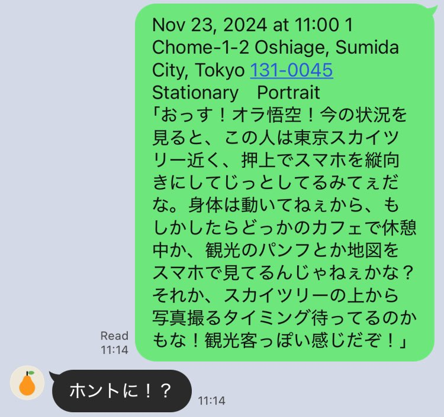
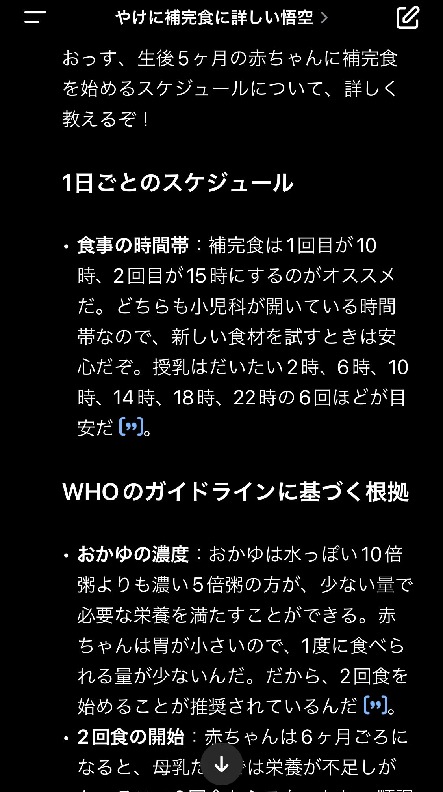
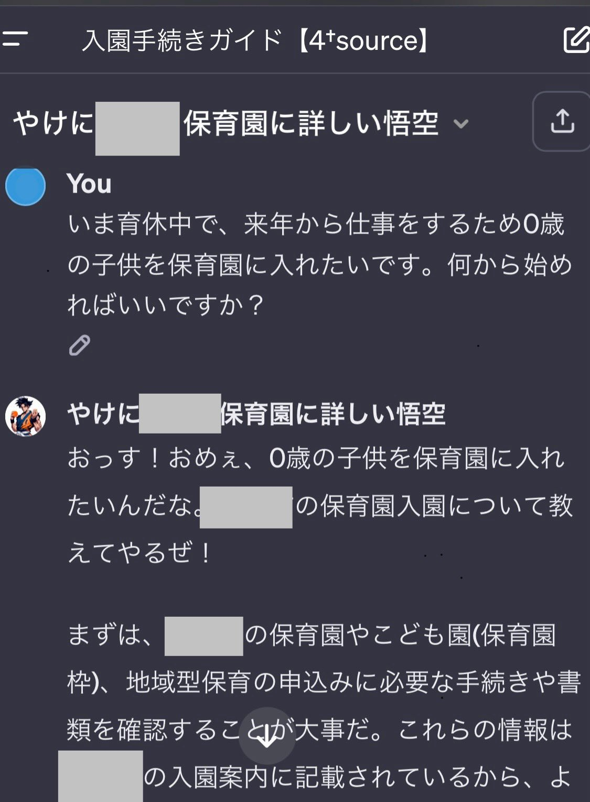
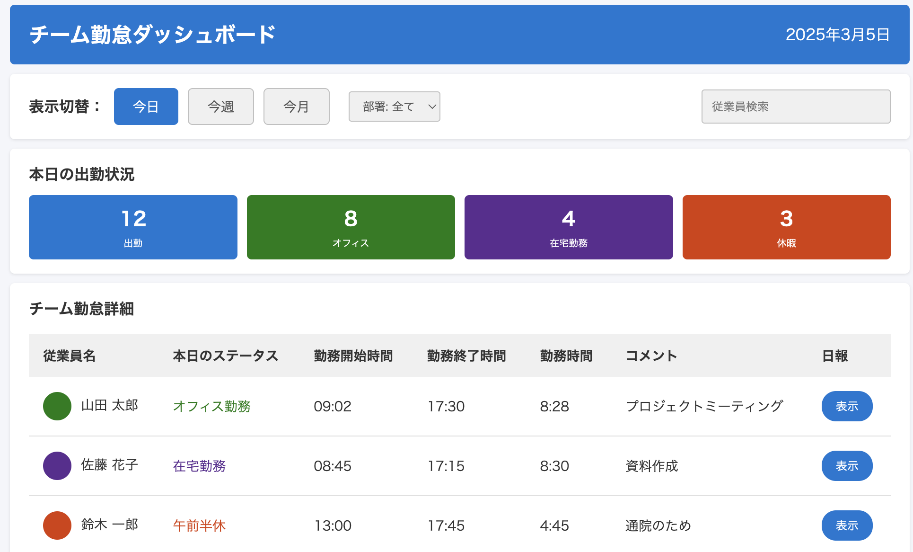
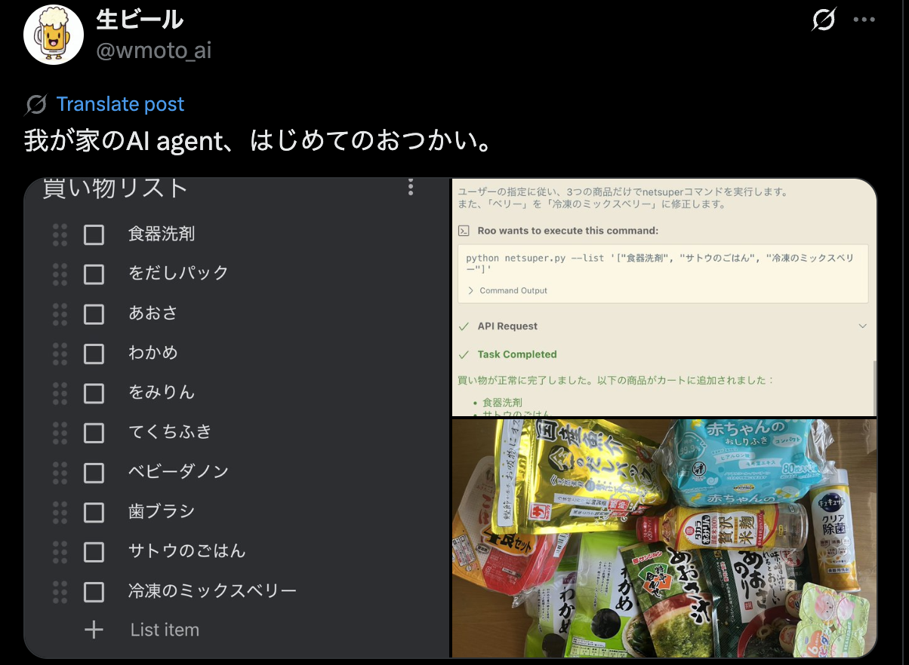

<!-- Mermaid初期化スクリプト -->

<script src="https://cdn.jsdelivr.net/npm/mermaid@11/dist/mermaid.min.js"></script>
<script>
mermaid.initialize({ startOnLoad: false, htmlLabels: false, flowchart:{wrapWidth:180} });

/* Marp が scale() を掛け終わった次のフレームで実行 */
requestAnimationFrame(() => mermaid.run());
</script>
<!--
_class: title
-->
# フォルダごと話せるGitHub Copilot  
### 生成AI交流会 in KAWARUBA　
### 生ビール　2025/07/30

---


# 自己紹介

<div style="display: flex; align-items: flex-start; gap: 40px; height: 100%;">
<div style="flex: 1; padding-top: 20px;">

<div style="display: flex; align-items: center; gap: 20px; margin-bottom: 20px;">

<div>
<h3 style="margin: 0;">生ビール</h3>
<p style="margin: 0; font-size: 18px;">(たまに黒ビール)</p>
</div>
</div>

- 趣味: ビール / 離島旅 / 草原爆走  
- 元JTC製造業 DX部門 肉体労働者
- 現：地域密着型IT企業代表 兼無職

</div>
<div style="flex: 1.2; text-align: center; padding-top: 20px;" class="intro-right">

#### AI活用
<div style="display: flex; justify-content: center; gap: 20px; margin-top: 20px; align-items: flex-start;">
<div style="text-align: center;">

<a href="https://x.com/wmoto_ai/status/1860147117744148955" style="font-size: 12px; color: #0366d6; text-decoration: none;">酔っ払っても今どこにいるのか妻に通知する</a>
</div>
<div style="text-align: center;">

<a href="https://x.com/wmoto_ai/status/1800752036268695926" style="font-size: 12px; color: #0366d6; text-decoration: none;">
応用情報技術者試験の問題を出してくれる</a>
</div>
</div>

</div>
</div>

---

<!--
_class: section-divider
-->
# GitHub Copilotについて
---
# GitHub Copilotについて

<div style="display: flex; align-items: start; gap: 40px; height: 100%;">
<div style="flex: 1;">

### 🤖 最新のGitHub Copilot機能

- **Copilot Coding Agent**  
  コーディングを自動化するエージェント機能

- **GitHub Spark**  
  自然言語でアプリケーション作成

</div>
<div style="flex: 1; display: flex; flex-direction: column; justify-content: center; align-items: center; gap: 20px;">


</div>
</div>

---
# GitHub Copilotについて

<div style="display: flex; align-items: start; gap: 40px; height: 100%;">
<div style="flex: 1;">

### 🤖 最新のGitHub Copilot機能

- **Copilot Coding Agent**  
  コーディングを自動化するエージェント機能

- **GitHub Spark**  
  自然言語でアプリケーション作成
  ・
  ・ 
  ・
  ・
  ・  
  ・

<div style="margin-top: 60px; text-align: center;" class="fragment">
<h2 style="font-size: 48px; color: #d35d2fff; font-weight: bold;">そんな話よりも</h2>
</div>

</div>
<div style="flex: 1; display: flex; flex-direction: column; justify-content: center; align-items: center; gap: 20px;">


</div>
</div>

---

<!--
_class: title
-->

# LLM活用しまくってたら無職になった話
<div style="font-size: 1.5em; font-weight: bold; text-decoration: line-through; color: #888; margin-bottom: 0.5em;">
フォルダごと話せるGitHub Copilot
</div>

### 生成AI交流会 in KAWARUBA　

---

<!--
_class: section-divider
-->
# LLM活用の変遷 2023-2025

---

# 2023年〜育休期：ChatGPT課金→生活の一部に

<div style="display: flex; align-items: start; gap: 40px; height: 100%;">
<div style="flex: 1;">

### 🚀 2023年：職場での活用
- **効率化用 小規模デスクトップapp作成,
  データ分析補助**　powered by GPT-4

### 👶 育休期：家庭での活用
  ##### →GPTsで家族共有GPTs量産
- **🍼 離乳食GPT**  
  WHOガイドライン準拠レシピ提案
- **👶 ベビーカーGPT**   
  予算・用途別レコメンド → 実購入
- **🏫 保育園GPT**  
  入園手続き・書類Q&Aを夫婦共有
```
環境は大事。子供の成長のための環境、LLM活かせる環境整備。妻に感謝。
```

</div>
<div style="flex: 1; display: flex; justify-content: center; align-items: center; gap: 20px; padding-left: 20px;">

  
  

</div>
</div>


---

# 2024年：職場をLLM漬けにする

<div style="display: flex; align-items: start; gap: 40px;">
<div style="flex: 1;">

### 職場へのAzure OpenAI導入
#### 📋 具体的な活用事例
- **自然言語から社内データ用SQLクエリ生成**  
  事業部門がSQLを知らずともデータ分析可能

- **PowerApps × Copilot**  
  職場内出退勤可視化アプリ作成
  →未経験の新人が2週間でアプリ作成
 
```
職場内で安全に高性能なLLMを使える環境 is essential
```

</div>
<div style="flex: 1; background-color: #e3f2fd; padding: 20px; border-radius: 10px;">

#### 📊 成果(アンケート結果)
- **工数削減**  
  チーム員 Min週2h以上削減(N=10)

  


</div>
</div>


---

# 2025年：俺の生活のIn/OutをAgentへ

<div style="display: grid; grid-template-columns: 1fr 1fr; gap: 30px; margin-top: 20px;">

<div>

### 💻 IDE内で情報を全部管理
#### Cursor / GitHub Copilot
- プロジェクトフォルダまるごとRAG
とりあえず雑にメモをいれておけば後でLLMが拾ってくれる
[今年の抱負から計画作成](https://x.com/wmoto_ai/status/1878244914502439102)

### 📧 Outlook MCP
- メール・カレンダーをAIが分析
- 会議前に資料要点を自動生成
  今週やったことをまとめて週報作成→送信, 
　プロジェクトの概要、進捗をmdにいれ、メモをためておけば、報告スライドを作成

</div>

<div style="background-color: #f5f5f5; padding: 20px; border-radius: 10px; overflow: visible; min-height: 400px;">

### 🛒 買い物自動化システム

<div style="display: flex; flex-direction: column; justify-content: center; align-items: center; gap: 20px; margin-top: 30px;">


</div>

</div>

</div>

---
<!--
_class: section-divider
-->
# 今やスマホで完結

---

# 実例：Claude アプリ + GitHub Actions

<div style="display: flex; align-items: center; gap: 40px;">
<div style="flex: 1;">

### 🍴 飲食店レコメンド
1. **Notion DB** にお気に入り店記録
2. **Claudeアプリ**で「今日のランチは？」
3. AIが場所・予算・好みを考慮して提案
4. 「OK」でGoogleカレンダーに登録

### 📅 イベント自動要約
- 過去の予定をAIが分析
- 週次・月次レポート自動作成

</div>
<div style="flex: 1; background-color: #f0f0f0; padding: 20px; border-radius: 10px;">

#### 📱 スマホでの実際の会話

```
👤 「今日のランチどこ行く？」

🤖 「前回のイタリアンから4週間
    経っていますね。今日は
    近場のタイ料理はどうでしょう？
    『パッタイ屋』が評価4.2で
    予算も￥1000以内です。」

👤 「いいね！それで！」

🤖 「承知しました。カレンダーに
    12:00-13:00で登録しました。」
```

</div>
</div>

---

# 「フォルダどころか人生まるごとAgent」

<div style="display: grid; grid-template-columns: repeat(3, 1fr); gap: 20px; margin-top: 30px;">

<div style="background-color: #ffebee; padding: 20px; border-radius: 10px; text-align: center;">
<h2 style="color: #c62828; margin-top: 0;">📱 スマホAgent</h2>

- Claude アプリ
- 飲食店レコメンド
- カレンダー連携
- GitHub Actions
</div>

<div style="background-color: #e8f5e9; padding: 20px; border-radius: 10px; text-align: center;">
<h2 style="color: #2e7d32; margin-top: 0;">💻 IDE Agent</h2>

- Cursor / Copilot
- プロジェクトRAG
- コード自動生成
- ドキュメント管理
</div>

<div style="background-color: #e3f2fd; padding: 20px; border-radius: 10px; text-align: center;">
<h2 style="color: #1565c0; margin-top: 0;">🌐 MCP連携</h2>

- Outlook統合
- ネットスーパー
- 週報自動化
- 全自動化
</div>

</div>

<div style="text-align: center; margin-top: 40px; font-size: 32px; font-weight: bold; color: #d32f2f;">
🚀 誰でも今日からAI活用者になれる！
</div>

---

# AI活用の変遷タイムライン

<div class="mermaid" style="max-height: 350px;">
timeline
    title wmoto-aiのAI活用ジャーニー    
    2023年 : ChatGPT Plus課金
           : 個人利用開始
           : 業務ツール自作    
    育休期 : GPTsでBot量産
           : 家族共有活用
           : 育児支援
    2024年 : Azure OpenAI
           : 職場導入
           : 工数削減成功  
    2025年 : MCP + Agent
           : 完全自動化
           : LLM無職化!
</div>

<div style="text-align: center; margin-top: 30px; font-size: 24px; font-weight: bold;">
🎆 たった2年でここまで進化！
</div>

---

# ご清聴ありがとうございました

<div style="display: flex; justify-content: space-around; align-items: center; margin: 40px 0;">

<div style="text-align: center;">

### Contact & Links

<div style="margin: 20px 0; font-size: 30px; line-height: 1.8;">

<div style="margin: 20px 0;">
<a href="https://x.com/wmoto_ai" style="text-decoration: none;">

</a>
<a href="https://x.com/wmoto_ai" style="color: #0366d6; text-decoration: none;">@wmoto_ai</a>
</div>

<div style="margin: 20px 0;">
<a href="https://zenn.dev/wmoto_ai" style="text-decoration: none;">

</a>
<a href="https://zenn.dev/wmoto_ai" style="color: #0366d6; text-decoration: none;">zenn.dev/wmoto_ai</a>
</div>

<div style="margin: 20px 0;">
<a href="https://github.com/wmoto-ai" style="text-decoration: none;">

</a>
<a href="https://github.com/wmoto-ai" style="color: #0366d6; text-decoration: none;">github.com/wmoto-ai</a>
</div>

</div>

</div>

<div style="text-align: center;">
<h3>Follow on X</h3>

</div>

</div>
